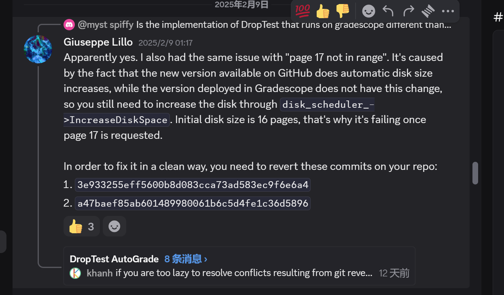

# Project1.1 BufferPoolManager 记录

趁着工作稍微轻松了一些，做一下 CMU 15445，也算是弥补一下本科的遗憾。这是在 Project3 完成后写的，没想到 Project1 花的时间要比 Project2 多得多，几乎是两倍的时间，做的过程也非常不顺利。并发问题太难 DEBUG 了，相比之下 Project2 只是对 B+ Tree 这个数据结构的几个操作了解透了就行。

虽然很感谢课程实验的作者，但说实话，我感觉官网上的实验说明写的并不好，好多地方一笔带过甚至没有提，读起来相当跳跃，写的时候往往会一头雾水。好在网上还有零星不错的博客，总算在他们的帮助下完成了。也是因为这我打算自己也写一点，把助人为乐的精神传递下去。

## page17 not in range

如果你在本地通过了，但是评测网站上遇到 `page17 not in range` 的问题，恭喜你遇到本篇文章。看解决方法前，**请先加入官网上给的 Discord 讨论群**，我一开始懒得加，后面才发现这群是多么宝贵。这个问题也是我群里面搜了一下才发现的。

解决方案就是回退 git，如下图所示：




## LRU-K 实现

LRU-K 的原理自行查阅和理解。只谈我实现踩过的坑，LRU-K 的成员变量主要有：

```cpp
  // 直接查找对应的 Node
  std::unordered_map<frame_id_t, LRUKNode> node_store_;
  // 维护一个红黑树，按照 backward k-distance 排序，只存储 evictable 的 Node
  std::set<LRUKNode> tree_;
  // 维护一个迭代器，直接找到在 tree 的位置并立刻删除
  std::unordered_map<frame_id_t, std::set<LRUKNode>::iterator> tree_iter_store_;
```

### RecordAccess

我一开始认为 `RecordAccess(frame_id)` 新来的一帧之后，应该分为八种情况，也就是如下三种各自两种情况：
1. 树是否已经满了
2. node 是否在树中
3. node 的时间是否有更新

前两点好理解，比如如果树是满了、node 又不在树里面，那么就要把时间最旧的那个节点踢去出。对于第三点，解释一下，LRU-K 每个 node 维护 K 个时间，如果 node 没有 K 个 时间，那这个 node 的最旧时间没有更新，所以这个第三点可能决定了 node 要不要在树中更新位置。

当时想了很久，其实实现不难，主要花了很长时间想想怎么才能性能最好。这也是教训：**不要提前取做优化，先完成实现再说。**

---

但后来发现其实我理解错了：树永远不会满，相当于 `node_store_` 有多少，树就有多大。

因为这个 LRU-K 上层有个 BufferPoolManager，LRU-K 是它的成员变量。bpm 确保只会在 `0-n` 之间操作，即最后是内存是 LRU-K，每次 bpm 只会说把 Page 放到 i-th Frame，这个 i 不会超过最大值，所以树永远不会超过 n 的。


知道这一点就好做多了，就只要考虑四种情况就行。请自行实现。

### Evict 的处理

里面有个 evict 操作，意思也好理解，如果是 evictable，那么就不可替换。但如果只是简单的设置一个属性，那会对查找带来麻烦：如果查找树中最旧的，发现不可替换，怎么办？

所以每次如果 `SetEvictable` 中某个节点变成不可替换，就要从树里删除。注意，只是从树里面删除，对于节点而言不会删掉，还放在 `node_store_` 中。同理，不可替换变成可替换，就重新插入到树里。

### 加锁

主要就是 c++ 的语法，这个问 AI，我觉得 AI 至少帮我完成速度提升了五倍。具体的，使用：`std::mutex latch_;`

每次加锁使用： `std::lock_guard<std::mutex> lock(latch_);`


## Disk Scheduler

更像是 CPP 语法题，这个多问 AI，没有 AI 我是真完成不了这实验。构造函数只有一句：

```cpp
// ChatGPT: 用传入的 lambda 表达式构造一个新的 std::thread 对象，并将它放到 background_thread_ 中。
// 等价 background_thread_ = std::thread([&]() { StartWorkerThread(); });
// 意思：background_thread 开始运行 StartWorkerThread 函数
background_thread_.emplace([&] { StartWorkerThread(); });
```

而 `StartWorkerThread` 函数中，每次从队列取出一个请求，然后使用 `disk_manager` 执行就好。

```cpp
void DiskScheduler::StartWorkerThread() {
  while (true) {
    auto request = request_queue_.Get();
    // 呼应析构函数，当 request_queue_ 中放入 std::nullopt 时，说明要结束
    if (request == std::nullopt) {
      break;
    }
    // 后来发现没必要，反正串行完成，直接在这里处理
    if (request->is_write_) {
      disk_manager_->WritePage(request->page_id_, request->data_);
    } else {
      disk_manager_->ReadPage(request->page_id_, request->data_);
    }
    // 对应 DiskRequest 的 callback_ 设置为 true，方便后续使用
    request->callback_.set_value(true);
  }
}
```