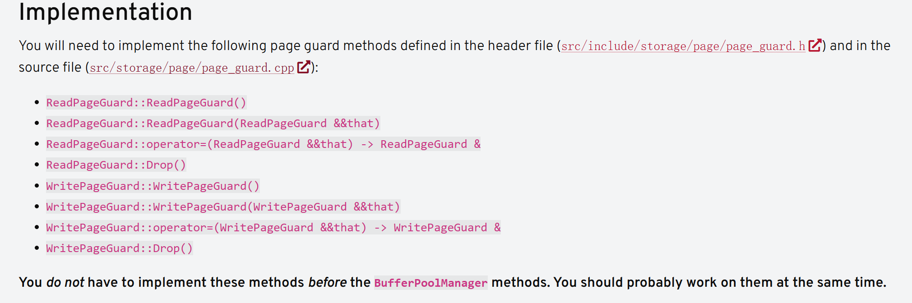

# Project1.2 BufferPoolManager 记录

主要是讲一下 PageGuard 的实现经历

## PageGuard 是什么

2024 Fall 中直接 Task3 就是 Buffer Pool Manager，但我感觉应该先实现 PageGuard，也就是 Task3 中的 Implementation 一开始说的：




实现这个需要先知道这个是干什么的，这个类真的很有用，不过实现的时候可能感觉不出来，到了后面才发现有这个辅助类真的省心太多了。可以直接看测试代码 `buffer_pool_manager_test.cpp`:

```cpp
TEST(BufferPoolManagerTest, DISABLED_VeryBasicTest) {
  // A very basic test.
  auto disk_manager = std::make_shared<DiskManager>(db_fname);
  auto bpm = std::make_shared<BufferPoolManager>(FRAMES, disk_manager.get(), K_DIST);

  const page_id_t pid = bpm->NewPage();
  const std::string str = "Hello, world!";

  // Check `WritePageGuard` basic functionality.
  {
    auto guard = bpm->WritePage(pid);
    CopyString(guard.GetDataMut(), str);
    EXPECT_STREQ(guard.GetData(), str.c_str());
  }
  std::cout << "WritePageGuard" << std::endl;

  // Check `ReadPageGuard` basic functionality.
  {
    const auto guard = bpm->ReadPage(pid);
    EXPECT_STREQ(guard.GetData(), str.c_str());
  }

  // Check `ReadPageGuard` basic functionality (again).
  {
    const auto guard = bpm->ReadPage(pid);
    EXPECT_STREQ(guard.GetData(), str.c_str());
  }

  ASSERT_TRUE(bpm->DeletePage(pid));
}
```

对 `PageGuard` 的理解就是它是一个 Page 的抽象，比如 `GetDataMut()` 那就是把 Page 的内容转成一个指针。

## PageGuard 的 RAII 要求

实现 PageGuard 必须要知道 RAII 是什么，简单讲，就是确保析构之后所有元素会释放掉。

最典型的，对于拷贝构造函数，它接收别人的东西，但必须确保：它之前的资源释放掉，别人的资源被他彻底接管，比如如下代码，里面的 `Drop` 是负责释放掉所有当前资源（比如解锁、释放空间）：
```cpp
ReadPageGuard::ReadPageGuard(ReadPageGuard &&that) noexcept {
  // 释放当前资源
  Drop();

  // 接管资源
  page_id_ = that.page_id_;
  frame_ = std::move(that.frame_);
  replacer_ = std::move(that.replacer_);
  bpm_latch_ = std::move(that.bpm_latch_);
  disk_scheduler_ = std::move(that.disk_scheduler_);
  read_mutex_ = std::move(that.read_mutex_);
  read_lock_ = std::move(that.read_lock_);
  is_valid_ = that.is_valid_;
}
```

至于 `Drop` 实现，这就是核心内容。但其实也不难，就是需要细心：**不是一股脑就释放的，不然有可能释放空资源报错，加一些判断即可。**

其中有一个 RAII 很经典容易犯的错误，拷贝或者 `operator=` 一定要判断是不是自己在赋值给自己：

```cpp
auto ReadPageGuard::operator=(ReadPageGuard &&that) noexcept -> ReadPageGuard & {
  // 一定要记得判断这个
  if (this != &that) {
    // ...
  }
}
```

## PageGuard 中的 Frame

PageGuard 是和 Page 的操作，但别忘了，对于 Page 而言，它加载在哪个 Frame 上也是很重要的信息，所以 PageGaurd 里面有 `FrameHeader` 和 `LRUKReplacer` 这两个数据结构。

比如构造函数时，需要把 `FrameHeader` 中的 `pin_count` 加一，这也是方便上层的 bpm，因为 bpm 处理要不要把某个 Frame 替换的时候，会看它的 `pin_count`。

还比如构造函数时，要把对应的 Frame 设置为不可替换。释放资源时，也要判断如果现在只有我这个 PageGuard 还和 Frame 绑定，那我释放资源就顺手把 Frame 设置为可以替换。

这些究竟是不是 PageGuard 要做的事情？其实 bpm 做也可以，但是管理起来还是很麻烦的，会分散各个函数中，所以就由 PageGuard 初始和析构时进行对 Frame 的操作。bpm 只负责真正挑选被替换的 Frame，然后加载 page 到其中。

## PageGuard 的锁

简单直接一点，就直接用 bpm 的锁。但其实这里面可以设置读写锁，即：可以多个读者一起读，但不能多个一起写；读和写并且又是互斥的。

C++ 支持这样经典的读写锁。具体方式问 AI，这里给一些提示：

```cpp
std::shared_ptr<std::shared_mutex> read_mutex_;
std::shared_lock<std::shared_mutex> read_lock_;

std::shared_ptr<std::shared_mutex> write_mutex_;
std::unique_lock<std::shared_mutex> write_lock_;
```

对哪个进行加锁？对 Frame 加锁啊，但肯定不是说直接 `lock(frame)`，而是 FrameHeader 里面要有个对应的变量，即最后 `lock(frame->xxx)`。具体不详细讲，知道读写锁语法其实就很容易写出来，而且这个变量已经告诉我们了。

直接再讲一下把，因为这里有一个注意点，之所以用 `shared_ptr`，就是因为我们大家都需要 `lock(frame->xxx)`，类型是 `shared_mutex`，所以每次先获取它的指针，然后再进行 `lock`。那很明显了