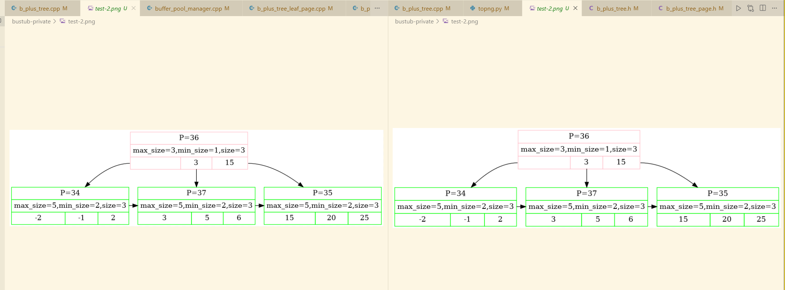

# Project2 BPlus Tree 记录

## 前言
没想到 Project2 如此顺利... 完成的居然比 Project1 还要快。从开始到结束大概 10 天，而且大部分时间也是在下班之后两三小时做的，当然周末花的时间也是很多。周日下午五点，在星巴克里完成一个重要的 Debug，内心兴奋奔腾，抬眼看窗外的阳光，这种感觉真好啊。再次想回到学生时代，给自己几个大耳巴子：XX，那么多时间你就待在宿舍网上冲浪是吧！！

## 整体上的注意点

### 先实现单线程时，可以不用管 Contex

虽然后面多线程你会发现这个巨好用 :)

### 不要做提前优化

代码结构上，不要因为代码冗长考虑太多。比如我这次总是想着把处理 Leaf 和 处理 Internal 的代码段结合起来，导致浪费了超级多的时间。其实**没必要考虑代码精简化**，因为处理 Leaf 和处理 Internal 的逻辑本来就是不一样的。

同时也不要太在意函数有过多的参数。比如我用的一个函数 `BorrowLeaf(LeafPage *now_btree_page, page_id_t &lpage_id, page_id_t &rpage_id, InternalPage *parent_btree_page, int parent_index)`，参数多就多呗，用起来是真好用。

### 调试时使用 Draw 出图，可以写一个 Python 脚本处理成图片

调用 `tree.Draw(bpm, "test-0.dot")` 这样的语句，可以出 dot 图，非常直观。然后 VSCode 显示 dot 图还要插件，还要再点击预览。所以可以写一个 Python 脚本把他们处理成 png 或者 svg（节点很多），由于 VSCODE 可以点击文件名就能看图，所以 png 很方便。这个思想也是从 jyy 感悟来的，多写点小脚本方便自己调试。比如下面的语句：
```python
import os

datadir = "/home/allen/bustub-private"
for fname in os.listdir(datadir):
    if fname.endswith('.png'):
        os.system(f"rm {os.path.join(datadir, fname)}")

for fname in os.listdir(datadir):
    if fname.endswith(".dot"):
        os.system(f"dot -Tpng {os.path.join(datadir, fname)} -o {os.path.join(datadir, fname.replace('.dot', '.png'))}")
        # os.system(f"dot -Tsvg {os.path.join(datadir, fname)} -o {os.path.join(datadir, fname.replace('.dot', '.svg'))}")
        os.system(f"rm {os.path.join(datadir, fname)}")
```

很简单，但最后生成 png 图片之后，方便程度立马提高许多，如下图所示，可以直接在 Vscode 分屏对比前后。如果节点多的话，那就老老实实生成 svg，在浏览器中打开吧。



### 循环时需要保存 PageGuard

这个是单线程时实现遇到的问题，实际上后来改为多线程后，用到了 contex 就不会有这个问题。

问题是这样的，上溯的过程中，我一开始这样写的：

<details>
<summary> Code </summary>

```cpp
  for (int i = 0; i < path_infos.size() - 1; i++) {
    auto left_page_id = path_infos[i + 1].left_page_id;
    auto right_page_id = path_infos[i + 1].right_page_id;
    auto parent_page_id = path_infos[i + 1].now_page_id;
    auto parent_index = path_infos[i + 1].in_parent_index;

    auto parent_page_guard = bpm_->WritePage(parent_page_id);
    auto parent_btree_page = GetInternalPage(parent_page_guard);

    // 在内部节点删除
    now_internal_page->RemoveRight(now_index);
    if (now_internal_page->IsValid()) {
      return;
    }
    // 尝试左右借
    if (BorrowInternal(now_internal_page, left_page_id, right_page_id, parent_btree_page, parent_index)) {
      return;
    }
    // 否则就尝试合并
    auto merge_choice = MergeInternal(now_internal_page, left_page_id, right_page_id, parent_btree_page, parent_index);
    assert(merge_choice != -1);
    // ...

    // 更新下一个需要删除的索引
    now_index = (merge_choice == 0) ? parent_index : parent_index + 1;

    // ! 一个很不容易注意到的 BUG，本来使用这条，是加快速度，不用下一个遍历再去取 page 了
    // ! 但是本次遍历结束之后，parent_guard 是循环内遍历，所以会释放，即 pin_count-1，即有可能这个 Page 会在下一次遍历被换出去！！！
    now_internal_page = parent_btree_page;
  }
```

</details>

正如注释所说，最后一条语句出问题了。原因是某次循环结束后，就会释放 `parent_page_guard`（因为我们没有保存它），所以这个 Page 就有可能在下次遍历时被换出去，而下一次我们还需要这个 Page。

究其原因是我们更替的是 `PageGuard` 的指针，而不是 `PageGuard` 对象，所以我们最后选择更替的是 `PageGuard` 即可：

```cpp
    now_internal_page = parent_btree_page;
    // 这条语句关键，即我们保存 PageGuard 让它不会释放，调用 析构函数
    now_internal_page_guard = std::move(parent_btree_page_guard);
```


## Insert 注意点

Insert 其实很简单。写两个用于分裂的函数 `SplitLeaf` 和 `SplitInternal`，然后在 Insert 中想想如何调用。唯一需要在意的是 **弄清楚 Internal 中的 Key 和 Value 排布**，其实就是 `Key[0]` 是无意义的，要小心。

对于 Internal，推荐插入写两个函数: `InsertRight` 和 `InsertLeft`，这样就清楚一点。因为 `Key[0]` 是无意义的，所以想添加到第一个的时候要调用 `InsertLeft(1, xx)`，这里我写错成 `InsertLeft(0, xx)` 就 Debug 了好久好久。

## Remove 注意点

Remove 的难度明显上升了几个维度。我一开始按照自己理解去实现，最后发现是错的... **这里推荐这个神链接**：http://www.cs.emory.edu/~cheung/Courses/554/Syllabus/3-index/B-tree=delete.html

我觉得推荐了这个链接就是这篇文章最大的价值了。我找了半天，我感觉全网没有比这个链接讲的更清楚的了，而且例子非常全面，甚至还有代码框架！！仔细阅读，然后实现即可。删除需要写多一点子函数，我写了四个：`BorrowLeaf`, `BorrowInternal`, `MergeLeaf`, `MergeInternal`；看名字也知道是啥意思了。

还有就是，向下寻找 Key 的时候，顺路把左右的 PageID 也保存下来，这样到时候调用 `MergeInternal` 之类的方法需要用到左右的 PageID。

合并的时候，左和右的情况不一样，和左合并相当于最后会删除自己，和右合并最后删除右子树，这里容易乱，编码要仔细些，我在这里就踩了坑。每次就一句错了，结果要调试半天。


## 多线程（并发）实现

### 感恩 Andy 和相关作者

其实 2024 Fall 的并发实现真的简单。而且完成它后也能理解编写者的良苦用心，做了非常多避免踩坑的操作：

1. Project1 实现了 PageGuard 类，并且考虑了并发
   在 Project1 我还纳闷为什么一定要新增这个类，在 Project2 终于理解了。每次访问 Page 的时候，我们使用 `bpm_->WritePage(pageid)`，这样就已经帮我解决了并发问题。因为 PageGuard 里面有锁，所以我们不用担心后续处理时这个 Page 被别的线程处理了。而且由于 Project1 中我们很好地实现了读写锁（即 ReadPage 和 WritePage），所以在 Project2 就非常方便方便。

2. 有一个 HeaderPage 来指向 RootPageID，以前是 RootPageID 直接作为对象的。
   无论增删查哪个操作，一开始都要查询 RootPageID，而以前直接作为对象不去思考并发就会踩坑。现在每次都会调用 HeaderPage 才能查询 RootPageID，即都要执行 `auto header_page_guard = bpm_->WritePage(header_page_id_);`，由于 WritePage 在 Project1 已经实现了并发，所以这里就没有并发问题了。

3. 每次操作有一个 Contex 类
   这个 Contex 类里面有 write_set，而且它是直到函数结束才会释放。假如我们想对某个 Page 一直持有锁，我们就可以放在 write_set 里面，想释放了，那就从 write_set 里面删除。这样就防止我们有可能会忘掉对某个 Page 进行操作，比如我们在循环里面申请一个 Page，循环结束这个 Page 就被释放了.. 所以我们每次申请之后加入到这个 write_set 里面，这样循环结束也不会被释放，防止我们淹没在细节里面。


### 本题上锁

回到本题，其实很简单，插入删除由于 Page 可能会动，所以要用写锁；查询就用读锁。利用所谓的螃蟹规则，即向下寻找的时候，判断当前节点会不会分裂或者合并，如果不会，就可以把它之前的祖先的锁都释放掉就行：

```
Search : Starting with root page, grab read (R) latch on child. Then release latch on parent as soon as you land on the child page.
Insert : Starting with root page, grabwrite (W) latch on child. Once child is locked, check if it is safe, in this case,not full. If child is safe, release all locks on ancestors.
Delete : Starting with root page, grab write (W) latch on child. Once child is locked, check if it is safe, in this case, at least half-full. (NOTE: for root page, we need to check with different standards) If child is safe, release all locks on ancestors.
```

上面提到，由于用的 Contex 中的 write_set，所以释放起来就很爽：
```cpp
  while (true) {
    auto now_btree_page_guard = bpm_->WritePage(now_page_id);
    auto now_btree_page = GetInternalPage(now_btree_page_guard);

    // 检查是否安全，如果安全，则把之前的节点都 Drop 掉
    if (!(now_btree_page->IsLowerBound())) {
      ctx.write_set_.clear(); // 这里就很爽，把祖先的锁释放掉，那就直接从 write_set 删除即可
    }
    // 其实上面第一句 WirtePage 已经是加锁了，这里是防止如果不存到 set 中，循环下一次就会把 now_btree_page_guard 释放掉
    ctx.write_set_.push_back(std::move(now_btree_page_guard));
    // ...
  }
```

### 兄弟节点的锁问题

还有一个问题：分裂、借用、合并的时候，那些兄弟应该如何上锁？由于我都是各自包装成一个函数，其实函数里面分裂返回就结束了，不需要保留锁，即：
```cpp
auto Borrow(...) -> xxx {
    auto lpage_guard = bpm->WritePage(lpage_id);
    // 借用 ...

    // 最后返回就结束了，lpage_guard 的锁就已经释放了。
    return ...
}
```
归根结底，就是每个操作内部需要一直持有兄弟的锁。可以看这个[链接](https://www.cnblogs.com/wangzming/p/17647325.html)举的例子。

```
叶节点、内部节点发生borrow/merge 时，要先对兄弟节点加写锁，即使已经判断节点不安全且已经加了父节点的锁。这是因为父节点加锁可能在另一个操作释放锁到完成该操作之间；
例如A,B是叶节点兄弟，t1删除叶子节点A的值，t2删除B的值，B是安全的，按照以下顺序
1)t2加父节点锁，发现B安全，释放锁；
2)t1加父节点锁，发现A不安全，不释放锁；
3)t2删除节点B内的值；
4)t1合并A,B。
t1必须在4进行的时候对B加锁，直到B完成。
```

### 调试注意点

每次改完，记得把单线程的调试先跑一下，成功之后再去跑多线程...

## 参考资料
1. https://zhuanlan.zhihu.com/p/618912295
2. https://www.cnblogs.com/wangzming/p/17647325.html
