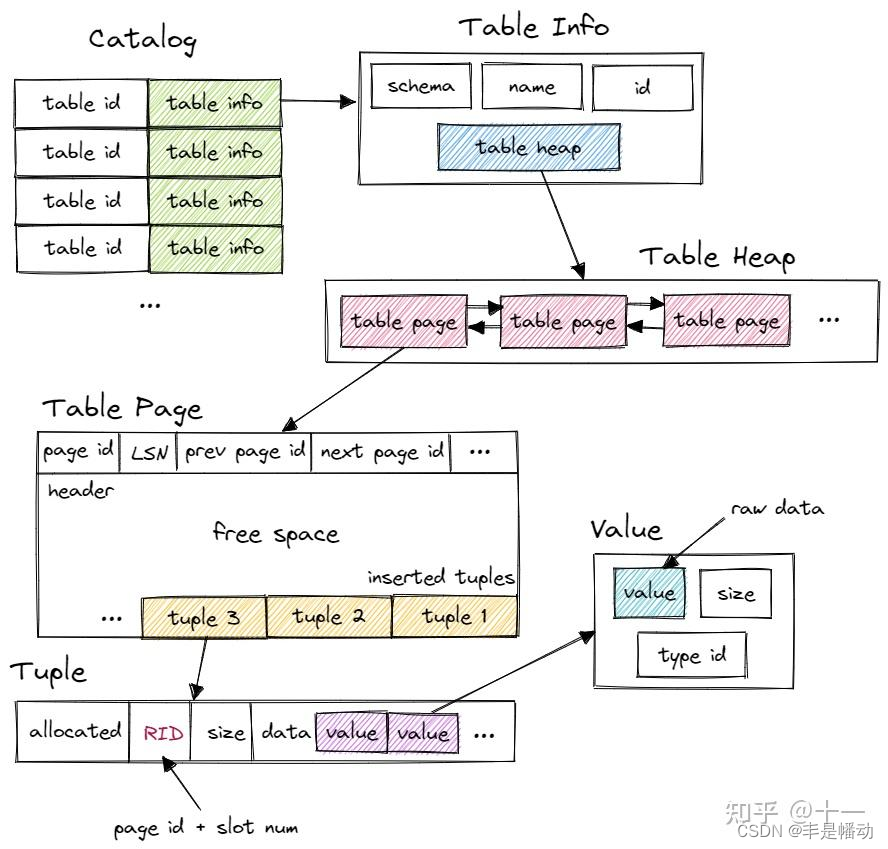
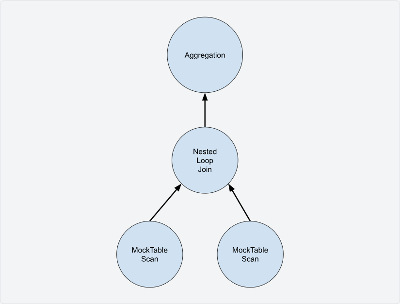

# Project3 第一个子任务 SeqScan 记录

开始做 Project3，网上都说这个很简单。所以就很有信心打开了官网，然后几十分钟过去，一片茫然无从下笔，对我而言仿佛回到了高中写作文的恐怖时刻。

不过现在是互联网时代，在几篇非常好的文章下，终于理解了，并且完成了 Seqscan 这一非常简单的实验。但虽然参考文章写的特别棒，对我而言还是花了不少时间理解，所以我也记录一下实验时候的心路历程，希望可以帮助到其他和我一样经历的人。

## 对 bustub 整体架构的理解

下面这张图片基本是躲不开的，这是 bustub 的整体架构：


包括官网在内，所有文章一开始都会进行介绍的，我一开始看感觉很抽象，根本不知道这个对实验有什么用。但是这个确实很重要，可以先留个印象，暂时不尝试理解。

- Parser：将SQL query转变为抽象语法树（AST）。Bustub 中采用了 libpg_query 库将 sql 语句 parse 为 AST。
- Binder：将查询语句与数据库元数据进行绑定，验证查询的正确性和有效性
- Planner：为查询生成逻辑计划，描述查询操作的顺序和方式
- Optimizer：对逻辑计划进行优化转换和选择最优的执行计划，以提高查询性能。

Project3 要做的就是 Optimizer 产生出计划后，根据它的要求去执行相关的语句，比如 Scan、Insert 等等。

## 开始做 seqscan

之后我看了许多准备工作，还是很茫然。所以干脆直接开始上手做吧，可以看到第一个简单的实验 seqscan 就是一个非常直接的 `SELECT * FROM table`，看具体的类：

```cpp
//===----------------------------------------------------------------------===//
//
//                         BusTub
//
// seq_scan_executor.cpp
//
// Identification: src/execution/seq_scan_executor.cpp
//
// Copyright (c) 2015-2025, Carnegie Mellon University Database Group
//
//===----------------------------------------------------------------------===//

#include "execution/executors/seq_scan_executor.h"
#include "common/macros.h"

namespace bustub {

/**
 * Construct a new SeqScanExecutor instance.
 * @param exec_ctx The executor context
 * @param plan The sequential scan plan to be executed
 */
SeqScanExecutor::SeqScanExecutor(ExecutorContext *exec_ctx, const SeqScanPlanNode *plan) : AbstractExecutor(exec_ctx) {
    // TODO
}

/** Initialize the sequential scan */
void SeqScanExecutor::Init() {
    // TODO
}

/**
 * Yield the next tuple from the sequential scan.
 * @param[out] tuple The next tuple produced by the scan
 * @param[out] rid The next tuple RID produced by the scan
 * @return `true` if a tuple was produced, `false` if there are no more tuples
 */
auto SeqScanExecutor::Next(Tuple *tuple, RID *rid) -> bool {
    // TODO
}
}  // namespace bustub
```

懵了，这里的好多看不懂的类... 而且我的 `SELECT * FROM Table`，我刚怎么拿数据呢？？

## 用实例理解 SQL 执行流程

其实上面的问题，就是在追问：Optimizer 之后的结果是什么？？比如 `SELECT * FROM Table` 的 Optimizer 是啥，这样我才好按照要求去做相关操作呀。

下面的例子就是非常关键、非常好的流程，看里面的注释，就能理解 Optimizer 最后的产出是什么了：

```cpp
// 原文链接：https://blog.csdn.net/qq_40878302/article/details/137741785

bustub> explain select * from test_1;
/* 这部分描述了 Binder 如何处理SQL查询。它解析了查询，并将SQL的文本表示转换为内部的数据结构。
在这个例子中，它表示查询选择了 test_1 表中的所有列（colA, colB, colC, colD）。
没有使用 GROUP BY, HAVING, WHERE 等任何其他的语句。
*/
=== BINDER ===
BoundSelect {
  table=BoundBaseTableRef { table=test_1, oid=20 },
  columns=[test_1.colA, test_1.colB, test_1.colC, test_1.colD],
  groupBy=[],
  having=,
  where=,
  limit=,
  offset=,
  order_by=[],
  is_distinct=false,
  ctes=,
}

/* 这部分展示了 Planner 生成的查询执行计划。
Projection：这是一个投影操作，意味着它将从下一级操作（在这种情况下是 SeqScan）中选择特定的列（这里是 #0.0 到 #0.3，它们对应于 test_1 表的 colA 到 colD）。
SeqScan：这是一个顺序扫描操作，意味着它将扫描整个 test_1 表以获取数据。
*/
=== PLANNER ===
Projection { exprs=[#0.0, #0.1, #0.2, #0.3] } | (test_1.colA:INTEGER, test_1.colB:INTEGER, test_1.colC:INTEGER, test_1.colD:INTEGER)
  SeqScan { table=test_1 } | (test_1.colA:INTEGER, test_1.colB:INTEGER, test_1.colC:INTEGER, test_1.colD:INTEGER)

/* 这部分展示了 Optimizer 进一步优化查询执行计划。但在这个例子中，它似乎没有做任何优化，只是简单地返回了与 Planner 相同的计划。
所以，优化后的计划仍然是一个简单的顺序扫描（SeqScan）操作。
*/
=== OPTIMIZER ===
SeqScan { table=test_1 } | (test_1.colA:INTEGER, test_1.colB:INTEGER, test_1.colC:INTEGER, test_1.colD:INTEGER)bustub> explain select * from test_1;
```

## 理解 bustub 如何去找数据

虽然根据上面的例子理解了 Optimizer 的产出结果，但是我还是不知道怎么去找数据。我现在要 SeqScan，而且我知道要修改对应的文件，但是看不懂里面的代码。

**所以先抛弃写代码，我们就想想用人类语言去找 bustub 数据**，所以要知道 bustub 的表结构，下面这张图特别好：



1. 首先，Bustub 有一个 Catalog。Catalog 维护了几张 hashmap，保存了 table id 和 table name 到 table info 的映射关系。table id 由 Catalog 在新建 table 时自动分配，table name 则由用户指定。

2. 这里的 table info 包含了一张 table 信息，有 schema、name、id 和指向 table heap 的指针。系统的其他部分想要访问一张 table 时，先使用 name 或 id 从 Catalog 得到 table info，再访问 table info 中的 table heap。

3. table heap 是管理 table 数据的结构，包含 table 相关操作。table heap 可能由多个 table page 组成，仅保存其第一个 table page 的 page id。需要访问某个 table page 时，通过 page id 经由 buffer pool 访问。

4. table page 是实际存储 table 数据的结构，当需要新增 tuple 时，table heap 会找到当前属于自己的最后一张 table page，尝试插入，若最后一张 table page 已满，则新建一张 table page 插入 tuple。table page 低地址存放 header，tuple 从高地址也就是 table page 尾部开始插入。

5. tuple 对应数据表中的一行数据。每个 tuple 都由 RID 唯一标识。RID 由 page id + slot num 构成。tuple 由 value 组成，value 的个数和类型由 table info 中的 schema 指定。value 则是某个字段具体的值，value 本身还保存了类型信息。

## 开始写 seqscan 代码

那么我们第一步起码要知道对应的表是什么，从上面的图知道，我们要知道 TableHeap 的位置。其实很简单，就是进去各个类里面去看对应的代码，比如我们肯定要知道 `catalog`，所以就去找有没有方法是和 Catalog 有关系的，果然就能找到。

```cpp
/** Initialize the sequential scan */
void SeqScanExecutor::Init() {
  // 需要声明 TableHeap *table_heap_;
  // 获取 TableHeap，难点在于理解这些结构；我的方法是根据那张结构图，逐渐地进各个类里面去找
  auto catalog = exec_ctx_->GetCatalog();
  auto table_id = plan_->GetTableOid();
  auto table_info = catalog->GetTable(table_id);
  table_heap_ = (table_info->table_).get();
  // ...

}
```

我的感受是不用慌，反正就是去找对应的结构就可以了。比如我当时是对 `SeqScanPlanNode` 不太理解，进去之后看到它的 `PlanNodeToString` 方法就发现了，其实这个也是一个包装类呗，看到了 `table_name_`，那说明这个类应该有 `table_id_` 之类的，果然就发现他有 `GetTableOid()` 方法：

```cpp
  auto PlanNodeToString() const -> std::string override {
    if (filter_predicate_) {
      return fmt::format("SeqScan {{ table={}, filter={} }}", table_name_, filter_predicate_);
    }
    return fmt::format("SeqScan {{ table={} }}", table_name_);
  }
```


## 理解火山模型

找到 TableHeap 之后，我们就可以遍历每一行数据了。但其实需要先保存下来，后面再去遍历，它的 `Next()` 需要使用。这个就涉及到理解火山模型。

说是火山模型，其实就是故意弄得一个高大上名词，本质上就是一层一层调用，如下图所示：



其实可以这样理解：第三层是 `SELECT * FROM Table1`；上面一层是 `SELECT * FROM Table1 WHERE colA>0`；第一层是 `SELECT colA+colB FROM Table1 WHERE colA>0`。实际操作中：

1. 第一层执行 `Next` 方法，它里面会去调用第二层的 `Next` 方法，然后第二层的 `Next` 里面实现又会去调第三层的 `Next`
2. 第三层是 Scan 层，即用来遍历的，所以它的 `Next` 方法直接就是返回当前行的数据
3. 第二层得到了第三层的返回数据，然后检查是否符合筛选条件，如果符合就会返回数据；如果不符合，就会再让第三层执行 `Next` 去获取下一行的表中数据，再次检查，直到返回合适的数据给第一层
4. 第一层得到第二层的返回数据，那么就会执行相加操作即可。然后继续调用 `Next` 方法，直到没有数据返回了

## 实现 seqscan 代码

了解了这个火山模型后，就明白了，我们需要先在 Init 保存好遍历的数据，然后 Next 中一行一行返回即可。

保存数据可以只保存 RID，这个我也是看别人的代码的，所以感觉其实 bustub 的实现有很多细节没有讲。

```cpp
/** Initialize the sequential scan */
void SeqScanExecutor::Init() {
  // 获取 TableHeap ...

  // 需要声明： std::vector<RID> rids_; std::vector<RID>::iterator rid_iter_;
  // 遍历 TableHeap，并且保存 RIDs
  auto iter = table_heap_->MakeIterator();
  while (!iter.IsEnd()) {
    rids_.push_back(iter.GetRID());
    ++iter;
  }
  rid_iter_ = rids_.begin();
}
```

然后实现 `Next()` 方法，这个方法如前面所说，是上一层主动调用我们这一层的 `Next()` 方法，它的参数是 `Next(Tuple *tuple, RID *rid)`。所以我们要把当前行的数据放到 `tuple` 和 `rid` 上，这样上一层就可以知道它们了。

第一个注意点：有返回没被删除的条目，所以每次要检查当前条目的 `is_deleted`，如果被删就不要返回这个，继续找下一行。

第二个注意点：我看到初始化中传入的代码 `SeqScanPlanNode` 里面还有 filter_predicate，即过滤条件，这个先不管它。

```cpp
auto SeqScanExecutor::Next(Tuple *tuple, RID *rid) -> bool {
  // 遍历 rids，每一次上层会调用 Next，每次调用就把当前的 rid 对应结果放在 tuple 中，让上层用
  while (true) {
    if (rid_iter_ == rids_.end()) {
      return false;
    }
    // 根据 RID 获取数据
    auto tuple_meta = table_heap_->GetTupleMeta(*rid_iter_);

    // 找到之后：检测是否删除、检测是否符合过滤条件
    // TODO: 暂时忽略过滤
    auto is_ok = !tuple_meta.is_deleted_;
    if (is_ok && plan_->filter_predicate_ != nullptr) {
      // is_ok = plan_->filter_predicate_->Evaluate(tuple, exec_ctx_->GetCatalog()->GetTable(plan_->GetTableOid())->schema_).GetAs<bool>();
    }

    // 符合条件，那么赋值，并且返回 true
    if (is_ok) {
      *rid = *rid_iter_;
      *tuple = table_heap_->GetTuple(*rid_iter_).second;
      ++rid_iter_;
      return true;
    }
    ++rid_iter_;
  }
  return false;
}
```

## 测试

Project3 巨爽的一点是直接可以本地检查全部条件，参考官网给的方式即可：

```bash
make -j$(nproc) sqllogictest
./bin/bustub-sqllogictest ../test/sql/p3.00-primer.slt --verbose
```