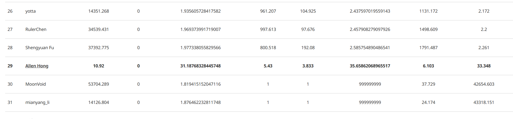

# Project4.b Serializable 的实现


## 第一版实现

测试时发现 `terrier.cpp` 里面的 benchmark 测试会出错，然后 AI 解决了这个问题。

根因已经很明显了：`bench-2` 这里失败不是执行器报错，而是 **两笔本该在 SERIALIZABLE 下互斥的事务都成功提交了**。这里解释 `terrier.cpp` 里这段为什么会要求：

`one of the txns should be aborted!`

它对应的是一个很典型的 **write skew / 可串行化冲突** 场景。

### 例子

假设表里一开始有两只狗：

- `terrier=3, token=10000, network=3`
- `terrier=7, token=10000, network=7`

现在 benchmark 里会构造两笔事务：

```sql
-- T1
SELECT network as value FROM terriers WHERE terrier = 7;
UPDATE terriers SET network = value, token = token + 1000 WHERE terrier = 3;

-- T2
SELECT network as value FROM terriers WHERE terrier = 3;
UPDATE terriers SET network = value, token = token + 1000 WHERE terrier = 7;
```

### 为什么两边都成功是不对的

如果按照 `T1.select -> T2.select -> T1.update -> T2.update` 的顺序执行，最后结果会变成：

- `3` 的 `network = 7`，即 `terrier=3, token=11000, network=7`
- `7` 的 `network = 3`，即 `terrier=7, token=11000, network=3`

这件事在真实时间上看好像没问题，但在 **SERIALIZABLE** 下，数据库要求结果必须等价于某个串行顺序。

我们来试：

1. 如果先执行 T1，再执行 T2

- T1 执行后，`terrier=3, token=11000, network=7`; `terrier=7, token=10000, network=7`
- T2 执行后，`terrier=3, token=11000, network=3`; `terrier=7, token=11000, network=7`

这和“两边都成功后的结果”不一致。

2. 如果先执行 T2，再执行 T1

- T2 执行后，`terrier=3, token=11000, network=3`; `terrier=7, token=11000, network=7`
- T1 执行后，`terrier=3, token=11000, network=7`; `terrier=7, token=11000, network=3`

这和“两边都成功后的结果”不一致。

所以：

- **不存在任何串行顺序** 能得到“两边都成功”的最终状态
- 因此在 SERIALIZABLE 下，**必须至少 abort 一个事务**

这就是 benchmark 里那句：

`one of the txns should be aborted!`


### 一句话总结

这个场景不是普通写写冲突，而是：

- **我读了 A**
- **你读了 B**
- **我改了 B**
- **你改了 A**

这叫 **读写依赖环**，是 serializable 必须拦住的经典模式。


### 实现 VerifyTxn()

解决这个需要重写 `TransactionManager::VerifyTxn()`，在这之前，需要先修改 `SeqScanExecutor::Init()` 和 `IndexScanExecutor::Init()` 来记录读集。如果事务隔离级别是 `SERIALIZABLE`，就把这次扫描的 filter predicate 记到事务的 `scan_predicates_` 里。这样事务提交时，才能知道自己“读过什么范围”。

比如说上面的例子，对于 T2 而言，它的第一句 `SELECT network as value FROM terriers WHERE terrier = 3` 的读集就是 `WHERE terrier = 3`，形式化可以说 `{table_oid: [(#0.0=3)]}`。

然后是**重写 `TransactionManager::VerifyTxn()`**，这里只用自然语言解释：

T1 提交完毕后，它会执行 `VerifyTxn(T1)`，这个没有问题。此时 `terrier=3, token=11000, network=7`，此时 T1 的 WriteSet 中记录了 `{table_oid: [rid1, rid2...]}`。

T2 提交完毕后，它会执行 `VerifyTxn(T2)`，此时会根据 T2 的 filter predicate 与 T1 的 writeset 挑出来冲突的 tuple，然后看一下 tuple 修改的部分是否被 T2 的 filter predicate 命中。

```cpp
  std::unordered_map<table_oid_t, std::unordered_set<RID>> conflict_rids;
  std::shared_lock<std::shared_mutex> lck(txn_map_mutex_);

  // 1. 遍历 txn_manager 中其他事务，查看是否与当前事务读集冲突
  for (const auto &[other_txn_id, other_txn] : txn_map_) {
    if (other_txn_id == txn->GetTransactionId()) {
      continue;
    }
    if (other_txn->GetTransactionState() != TransactionState::COMMITTED) {
      continue;
    }
    if (other_txn->GetCommitTs() <= txn->GetReadTs()) {
      continue;
    }

    // 遍历事务的写集，进行检查
    for (const auto &[table_oid, write_set] : other_txn->GetWriteSets()) {
      if (scan_predicates.count(table_oid) == 0) {
        continue;
      }
      conflict_rids[table_oid].insert(write_set.begin(), write_set.end());
    }
  }

  // 2. 后面处理各个 RID，检查是否存在不一致性
  std::optional<Tuple> current_tuple = base_meta.is_deleted_ ? std::nullopt : std::make_optional(base_tuple);
  auto undo_logs = CollectUndoLogs(rid, base_meta, base_tuple, undo_link, txn, this);
  auto visible_tuple = undo_logs.has_value() ? ReconstructTuple(schema, base_tuple, base_meta, *undo_logs) : std::nullopt;

  for (const auto &predicate : pred_iter->second) {
    // 检查 tuple 对应的列是否是被 predicate 命中
    const bool matches_visible = visible_tuple.has_value() && predicate->Evaluate(&visible_tuple.value(), *schema).GetAs<bool>();
    const bool matches_current = current_tuple.has_value() && predicate->Evaluate(&current_tuple.value(), *schema).GetAs<bool>();

    if (matches_visible || matches_current) {
        // ....
    }
  }
```

分为两部分：

第一部分是检查其他事务，在问：其他人有没有修改过我想要读的表？有的话那可能有风险哦，所以记录一下改了哪些 tuple（`write_set.begin(), write_set.end()`）。

第二部分是检查每个 tuple，首先记录这个 tuple 最新的版本，然后回溯到当时我这个事务开始时候的版本：

1. 这条记录在“我开始时”是不是落在我的读范围里？比如：我这个事务有一个动作是想要 `col2=10` 的 tuples，结果我发现真有一个 `col2=10` 的 tuple 被其他事务修改过，那我就怀疑了，这条 tuple 万一是被人删除的呢，所以我就要小心谨慎。
2. 这条记录在“现在”是不是落在我读范围里面？还是上面的例子，如果真有一个 `col2=10` 的 tuple，我就怀疑：这条 tuple 是不是我读过之后被人改成这样子的？

再说一下，为什么我要这么谨慎，**本质上是因为我读的值后面要用到**，所以此时会有 SERIALIZABLE 的风险，我要确保在此期间没人动过我读的数据。

## 第二版实现

上面可以解决掉 benchmark 的测试，但是在 Bonus 中的 `txn_abort_serializable_test` 中，还是存在一些问题。其实区别就是：

第一版只看开头结尾；第二版是每次回溯都看一下是否命中，这样比如“改了又改回去”的情况也能拎出来。这里就不细谈了。

## 总结

其实没有完全百分百理解，但其实无所谓了，这个直接喂给 AI，他应该会回答的很好。其实不难，主要就是逻辑上多思考思考就行，所以我也不太想要花时间去太过思考这个了。

那这样整个 CMU 15455 就结束了，照例贴一张 Project4 的结果：



没有想到这么顺利。